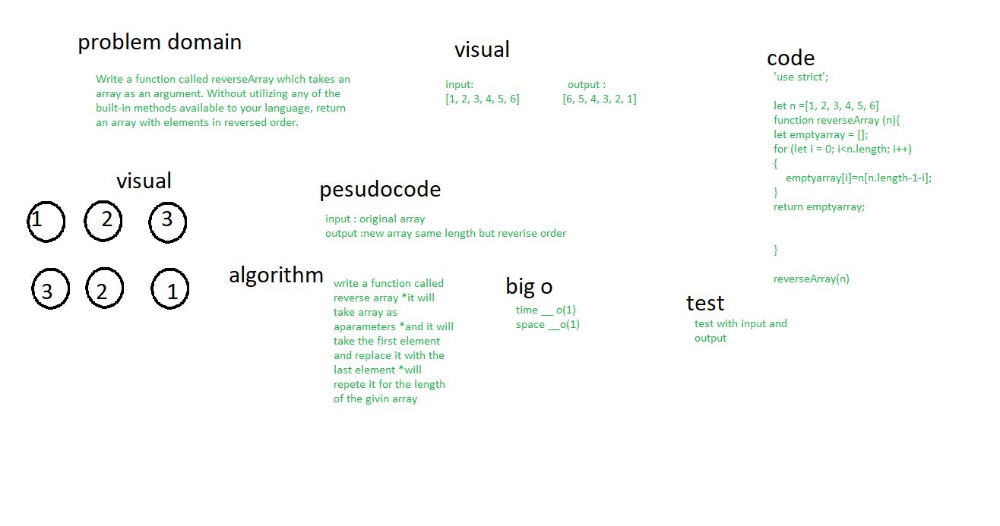

# data-structures-and-algorithms401
# Reverse an Array
 Create a function to reverse array

 # Whiteboard Process

# Approach & Efficiency
* I took the output input approach, it will show the result how it should be 
 * using for loop to looping throw array that reverse them into a new array