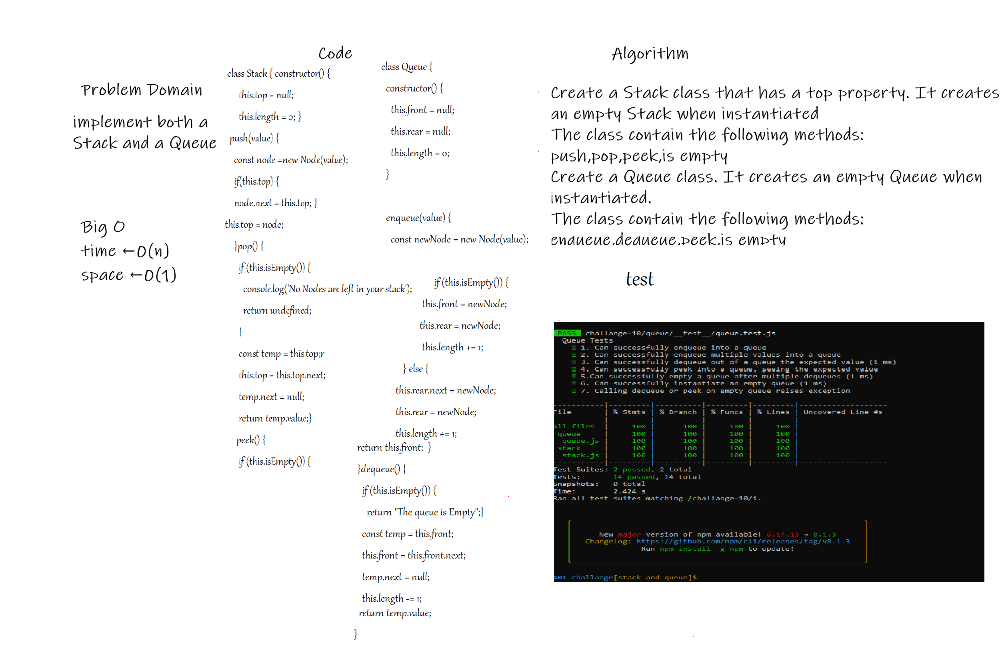
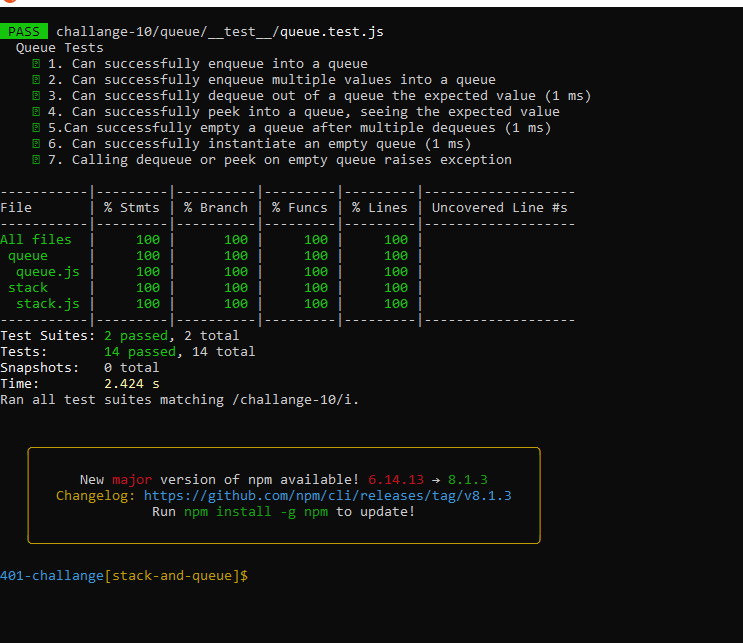

# Challenge

## Stack
push onto a stack push multiple values onto a stack pop off the stack empty a stack after multiple pops peek the next item on the stack instantiate an empty stack Calling pop or peek on empty stack raises exception

## Queue
enqueue into a queue enqueue into a queue enqueue multiple values into a queue dequeue out of a queue the expected value peek into a queue, seeing the expected value empty a queue after multiple dequeues instantiate an empty queue Calling dequeue or peek on empty queue raises exception

# API
## Stack
push : to add an item to the top of stack pop :to remove an item from the top peek : to know the top value

## Queue
Enqueue : to add an item to the rear Dequeue :to remove an item from the front peek : to know the front

# Whiteboard Process

### Approach & Efficiency
<!-- What approach did you take? Discuss Why. What is the Big O space/time for this approach? -->
- I took the output input approach, it will show the result how it should be 

# test 

# checklist 👍
- [x] stack methods
- [x] queue methods
- [x] tests
- [x] Top-level README “Table of Contents” is updated
- [x] README for this challenge is complete  
- [x] Picture of whiteboard 
- [x] Link to code
- [x] Feature tasks for this challenge are completed
- [x] Unit tests written and passing 
- [x] “Happy Path” - Expected outcome 
