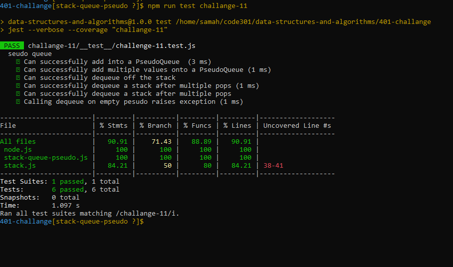

##  Stack-Queue-Pseudo

Is to implement a standard queue interface (the two methods Stack and queue).

## Whiteboard Process

# Test

# Approach & Efficiency
The challenge leans toward a solution close to implemented the stack and the queue in that way.