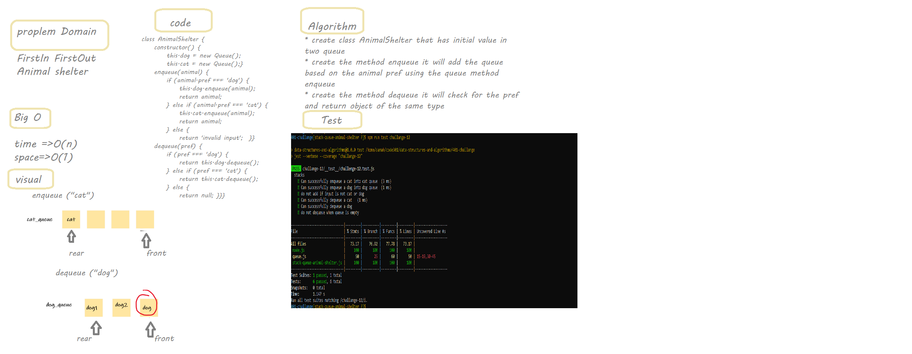
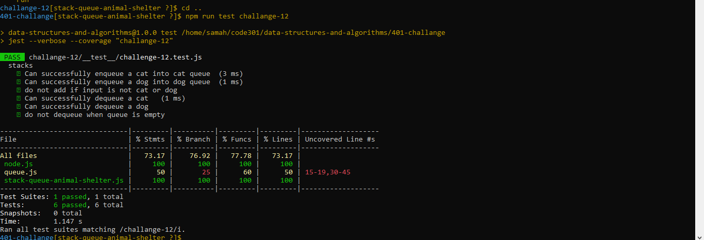

# Stacks Queues Animal Shelter

First-in, First out Animal Shelter.

# Whiteboard Process

# Test Case

# Approach & Efficiency
The challenge leans toward a solution close to implemented the stack and the queue in that way.