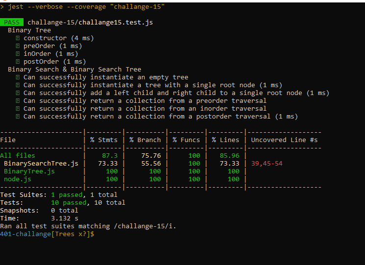

## Challenge

using tree non-linier algorithim we can sort the nood using three approuch , preorder , inorder , postordar , to make the node easy to search and move on any node we need.

# Approach & Efficiency
understood the problem first I imagined how the results should be I wrote the code I made the tests

### Test 

# API

# Big O

Time <--- O(n)
Space <----- O(1)

- [x] BinaryTree  methods
- [x] BinarySearch methods
- [x] tests

 - [x] Top-level README “Table of Contents” is updated
 - [x] README for this challenge is complete
       - [x] Summary, Description, Approach & Efficiency, Solution
       - [x] Big O 
 - [x] Feature tasks for this challenge are completed
 - [x] Unit tests written and passing
       - [x] “Happy Path” - Expected outcome
       - [x] Expected failure
