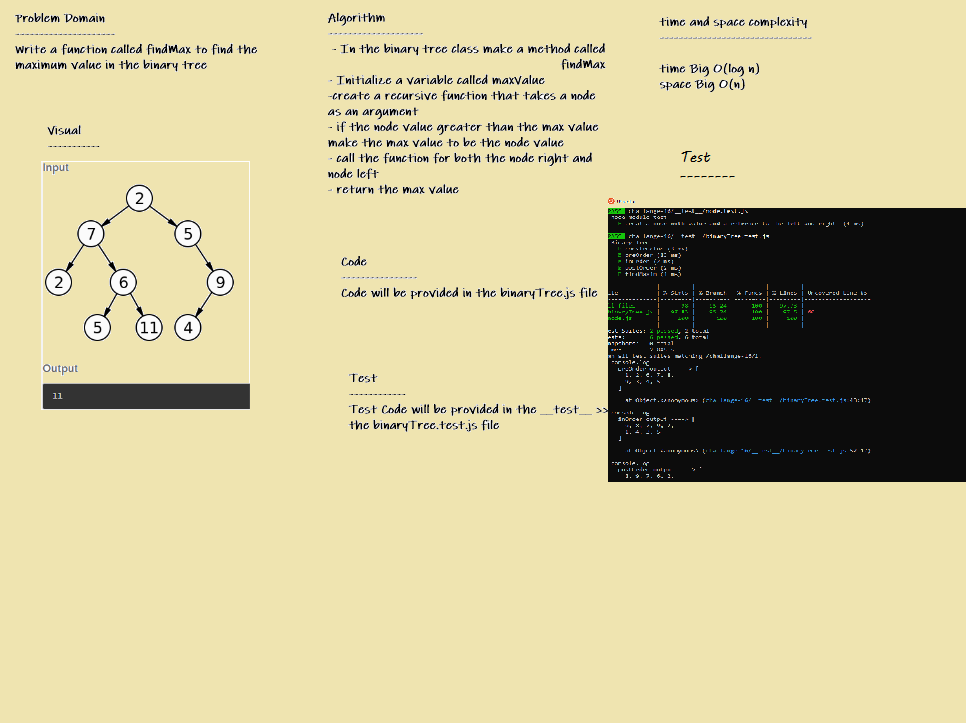
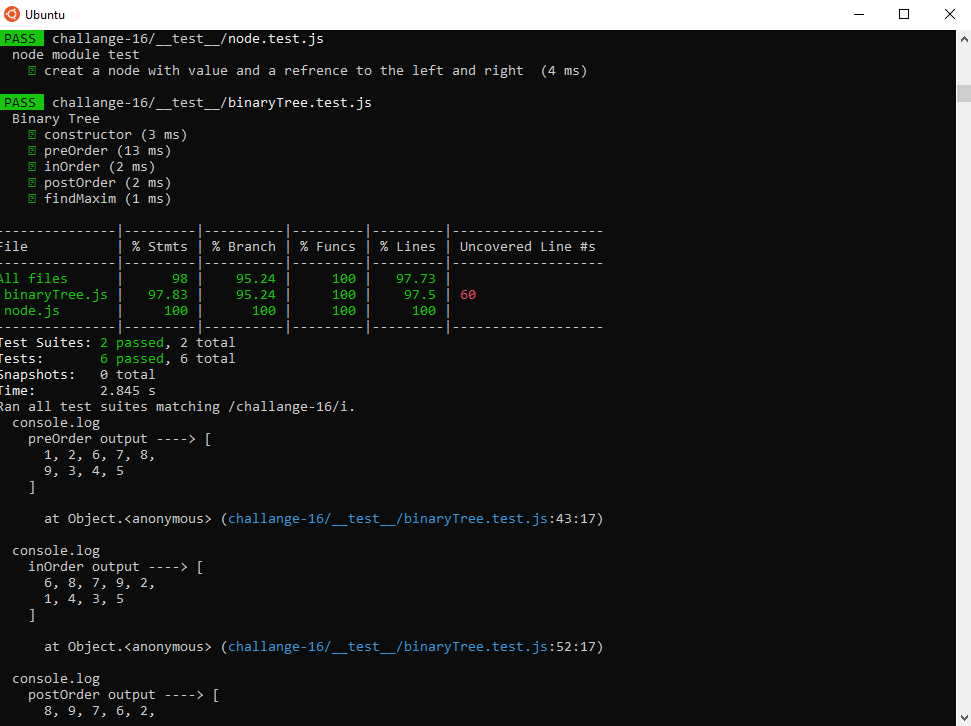

# trees-max

* *Write a function called findMax to find the maximum value in the binary tree*

## Whiteboard Process

## Test:

## Approach & Efficiency

- Utilize one of the DFS traversal methods already created in the class
- Establish a variable called 'currentMax' that takes the first item in the array
- Loop over the array; initialize i at 1
- Use a Boolean to compare array[i] to the currentMax
- if array[i] is greater than currentMax, reassign currentMax to array[i]
- return currentMax

## API

  * *findmax(): Return maximum value stored in the tree .*
