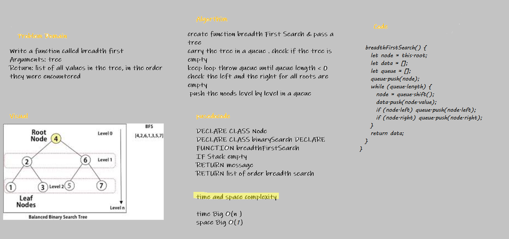
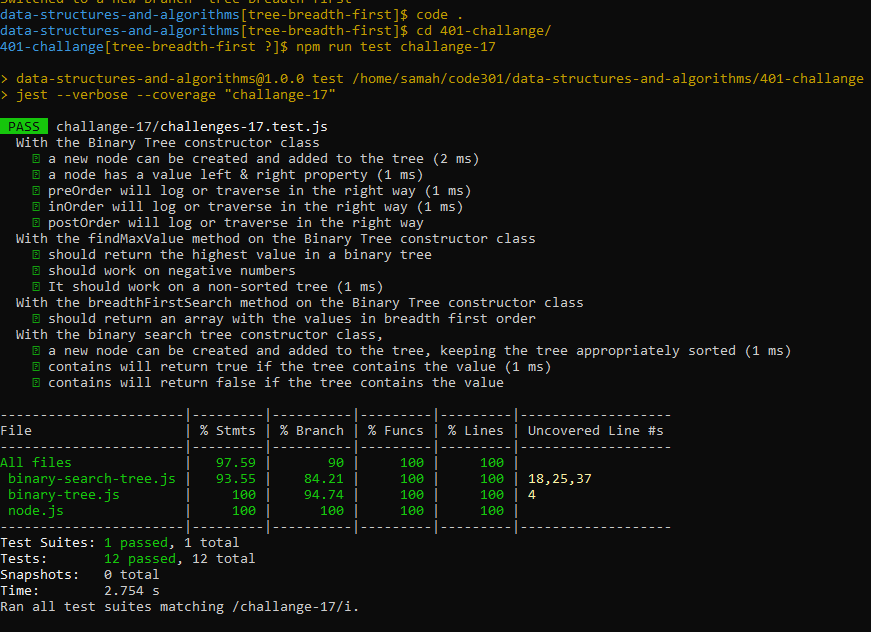

# Tree Breadth First

## Challenge Summary

Write a function called breadth first Arguments: tree Return: list of all values in the tree, in the order they were encountered
returns a list of all values in the tree level by level

## Whiteboard Process

## Test 

## Approach & Efficiency

- Start at the root
- Have an array for the values and a staging array that has all the nodes
- Interative Method: use a while loop that loops while there are still nodes in the queue array
- Take the first node from the queue array, and push it's value into the data array
- check all lefts & rights before going further down

# API
breadthFirstSearch() Return: list of all values in the tree, in the order they were encountered