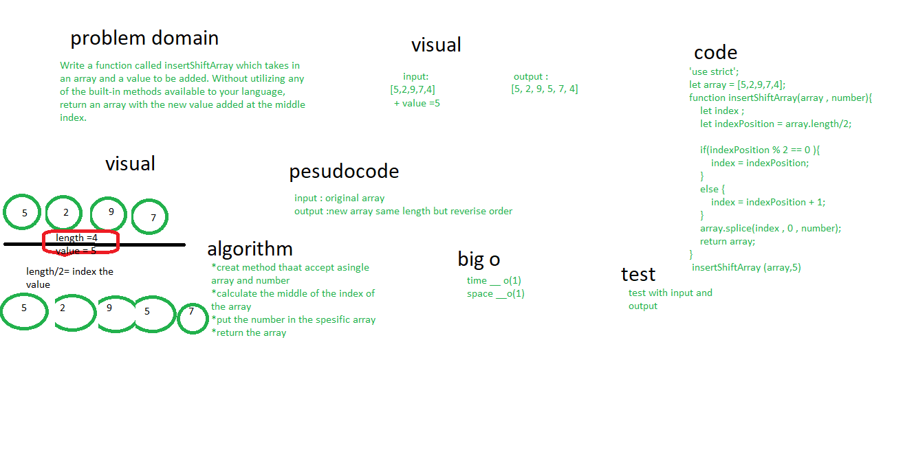

Write a function called insertShiftArray which takes in an array and a value to be added. Without utilizing any of the built-in methods available to your language, return an array with the new value added at the middle index. Example :

Input [5,2,9,7,4], 5
Output [5,2,9,5,7,4]

# Approach & Efficiency
I * took the output input approach, it will show the result how it should be