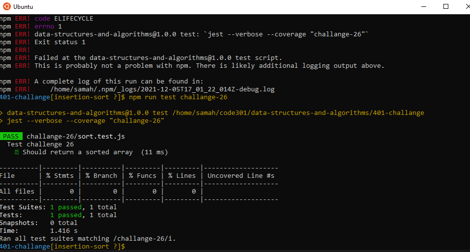
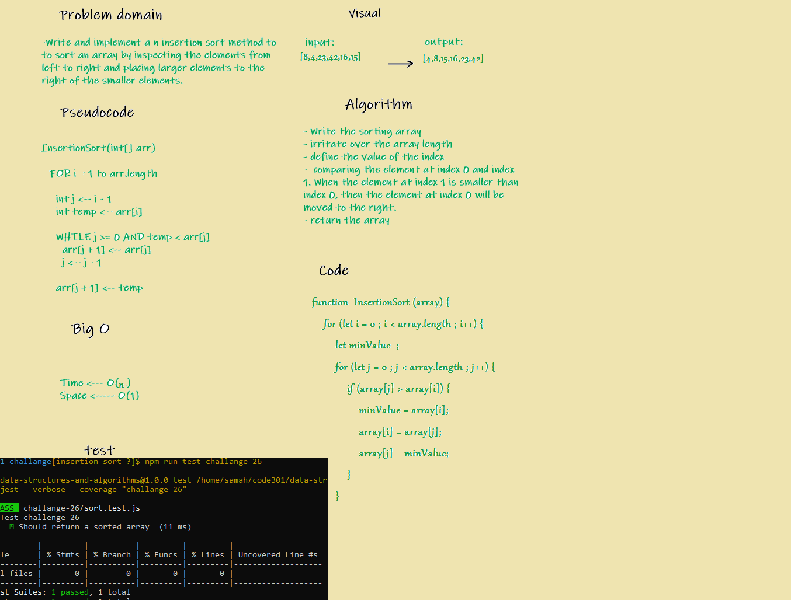

## Inseration Sort

To Write and implement a n insertion sort method to to sort an array by inspecting the elements from left to right and placing larger elements to the right of the smaller elements

# test :

 

 #  whiteboard

 
 

 # reverse sort steps
 

 ## Approach & Efficiency
we started from the seconed element in the array, and insted of moving the larger number to the end we draged the smaller one to the front under some conditions inside two nested loops.