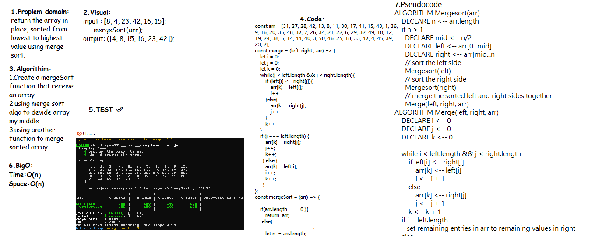
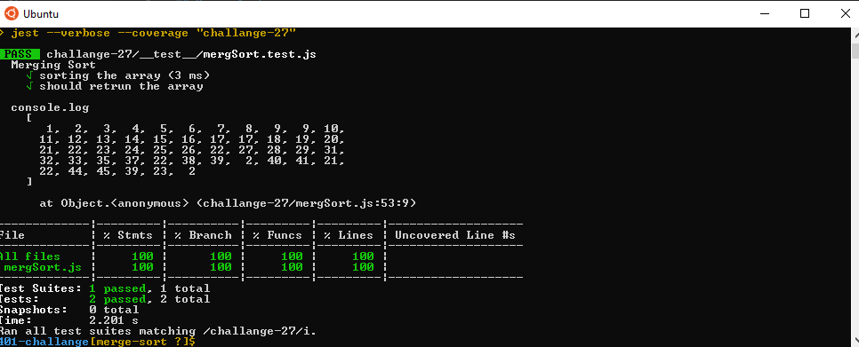

# Code challenge 27:

## Merge Sort

- To Write and implement a merg sort method to sort an array by inspecting the elements from left to right and placing larger elements to the right of the smaller elements.

## whiteboard

### steps 

## - test result:

## - Big O 
   - Time <--- O(n)
   - Space <----- O(n)

