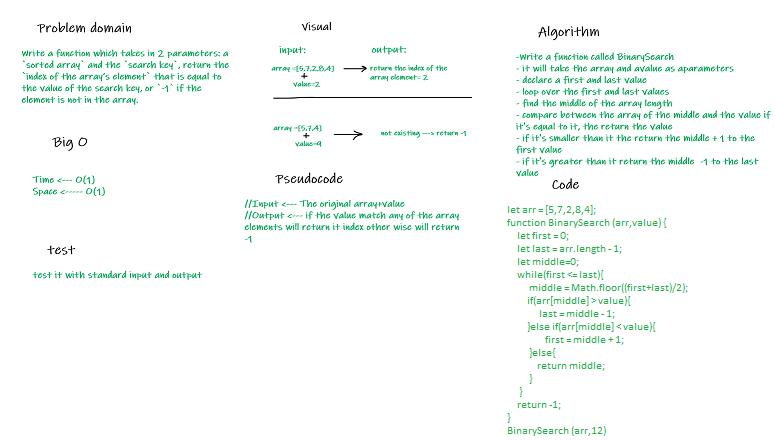

# Code challenge 3:

## Array-binary-search
- Write a function which takes in 2 parameters: a sorted array and the search key return the index of the array’s element that is equal to the value of the search key, or `-1` if the element is not in the array.

### Whiteboard Process

### Approach & Efficiency
- I took the output input approach, it will show the result how it should be 
