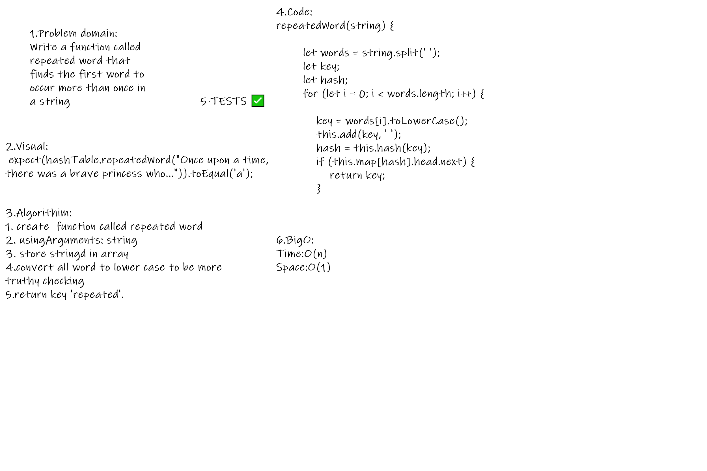
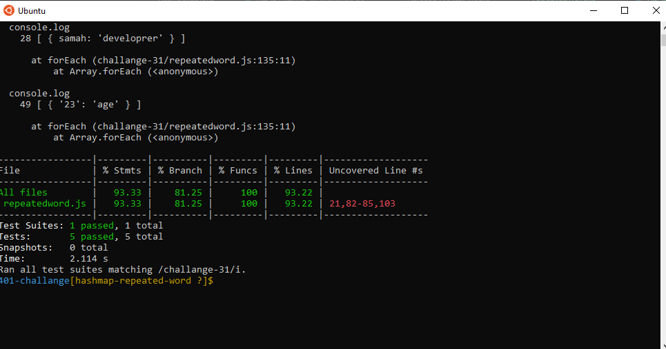

# Hash Table
<!-- Short summary or background information -->
A hash is the result of some algorithm taking an incoming string and converting it into a value that could be used for either security or some other purpose. In the case of a hashtable, it is used to determine the index of the array.

## Challenge
<!-- Description of the challenge -->
Implement a Hashtable Class with the following methods:

add
Arguments: key, value
Returns: nothing
This method should hash the key, and add the key and value pair to the table, handling collisions as needed.
get
Arguments: key
Returns: Value associated with that key in the table
contains
Arguments: key
Returns: Boolean, indicating if the key exists in the table already.
hash
Arguments: key
Returns: Index in the collection for that key
repeatedWord
Arguments: string
Return: string

## Approach & Efficiency
<!-- What approach did you take? Why? What is the Big O space/time for this approach? -->
BigO:
- Time:O(n)
- Space:O(1)

## Whiteboard Process
<!-- Embedded whiteboard image -->

## Test Result
