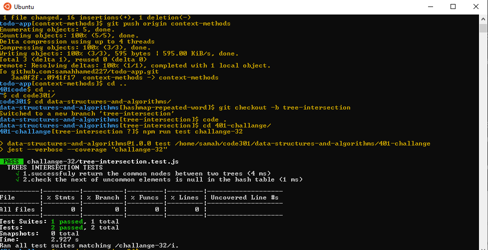
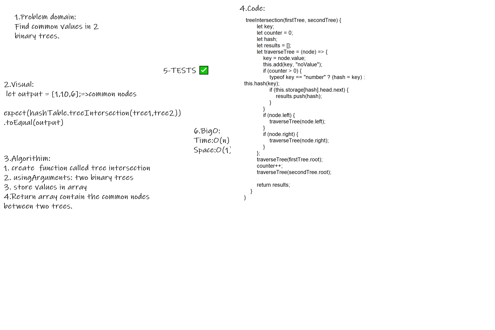

# Hashmap Tree Intersection
Find common values in 2 binary trees.

Find all values found to be in 2 binary trees

Write a function called tree intersection Arguments: two binary trees Return: array

# Test
 

## Approach & Efficiency
- Big O Time <--- O(n) 
- Space <----- O(1)

# Whiteboard Process

