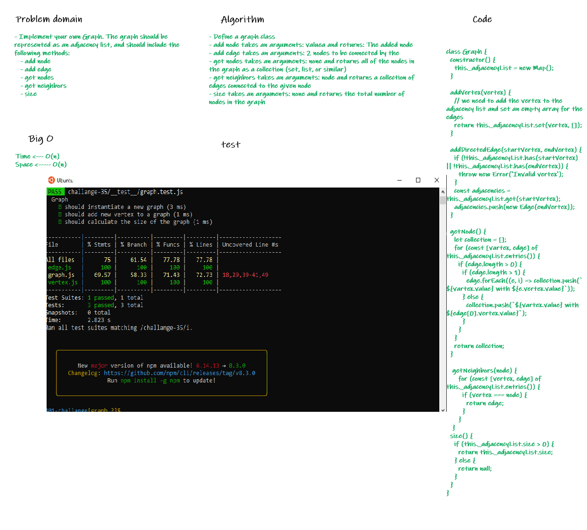

## Graph

- Implement your own Graph. The graph should be represented as an adjacency list, and should include the following methods:
   - add node
   - add edge
   - get nodes
   - get neighbors
   - size

### Whiteboard Process

### Approach & Efficiency

- test result:

- Big O 
   - Time <--- O(n)
   - Space <----- O(n)

