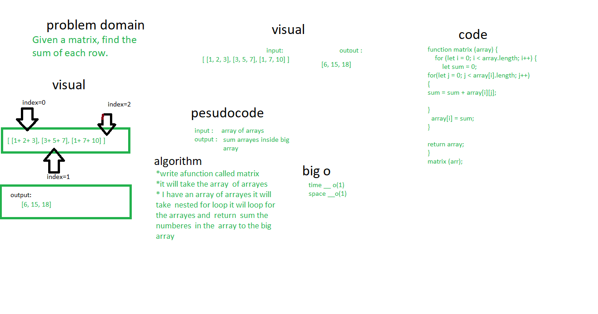

# Code challenge 4:

## matrix 
Given a matrix, find the sum of each row.

### Whiteboard Process

### Approach & Efficiency
- I took the output input approach, it will show the result how it should be 