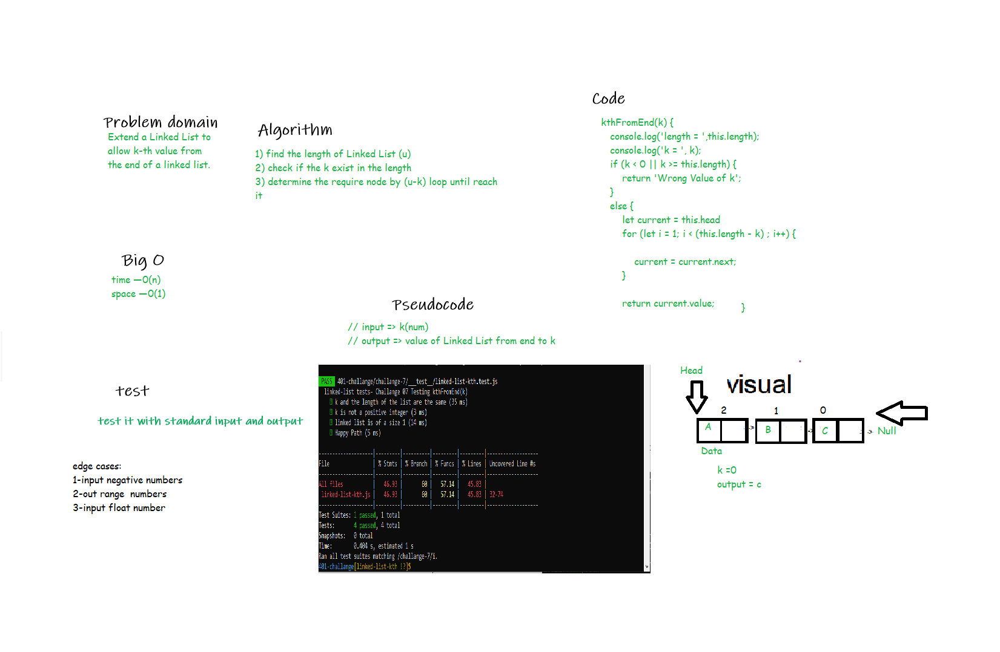

# linked list kthFromEnd(k)

<!-- Description of the challenge -->

Extend a Linked List to allow k-th value from the end of a linked list.

## Challenge
<!-- Description of the challenge -->
- Create a Node class that has properties for the value stored in the Node, and a pointer to the next Node.
-Create a Linked List class include a head property.
- The class should contain the following methods
append,insert before,insert after

## Whiteboard Process

<!-- Embedded whiteboard image -->

## API
<!-- Description of each method publicly available to your Linked List -->
1. append  method: It will take a value as an argument and return nothing and will adds a new node with that value to the head of the list
2. insert before method: It will take two values as an argument and will adds a new node with the given new value immediately before the first node that has the value specified.
3. insert after method : It will take two values as a parameters and will  adds a new node with the given new value immediately after the first node that has the value specified