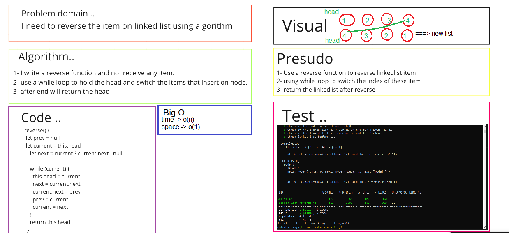
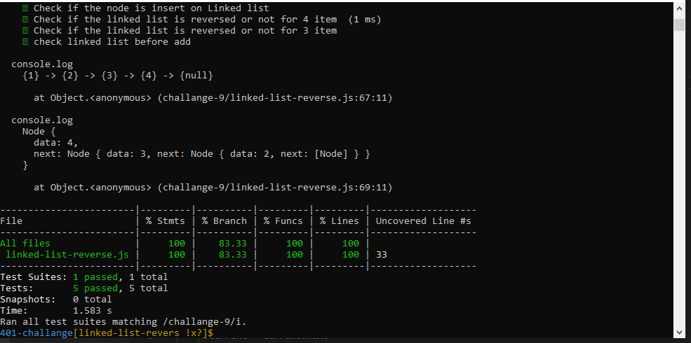

# Reverse Linked List

### Challenge:
- Write a REVERSED function to reverse linked list item. 

### Whiteboard Process

## Test 

# Approach & Efficiency
1. I understood the problem first
2. I imagined how the results should be
3. I made a drawings of how the linked list would be after reverse .
4. I wrote the code
5. I made the tests
