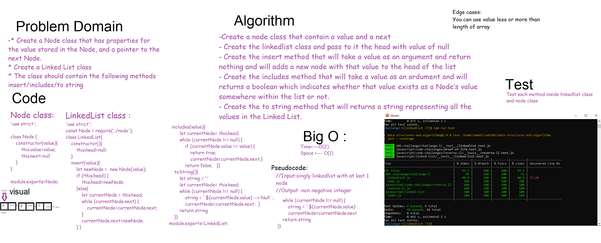
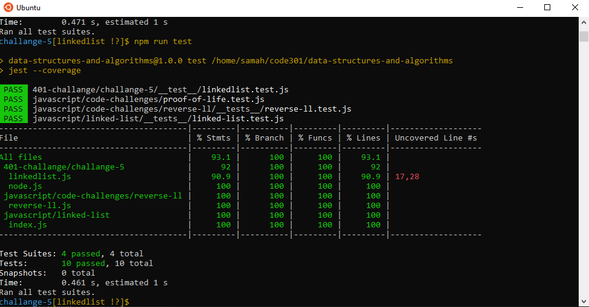

# Code challenge 5:

## Singly Linked List
- Linked List is a linear data structure,  linked list elements are not stored at a contiguous location; the elements are linked using pointers.

## Challenge
<!-- Description of the challenge -->
- Create a Node class that has properties for the value stored in the Node, and a pointer to the next Node.
-Create a Linked List class include a head property.
- The class should contain the following methods
insert,includes,to string

### Whiteboard Process

## Approach & Efficiency
<!-- What approach did you take? Why? What is the Big O space/time for this approach? -->
- Creating the linkedlist and node class including the methods then testing the result 

- Big O 
   - Time <--- O(2)
   - Space <----- O(1)

# Test :

## API
<!-- Description of each method publicly available to your Linked List -->
1. insert method: It will take a value as an argument and return nothing and will adds a new node with that value to the head of the list.
2. includes method: It will take a value as an ardument and will returns a boolean which indicates whether that value exists as a Node’s value somewhere within the list or not.
3. toString method :Returns: a string representing all the values in the Linked List, formatted as: "{ a } -> { b } -> { c } -> NULL"